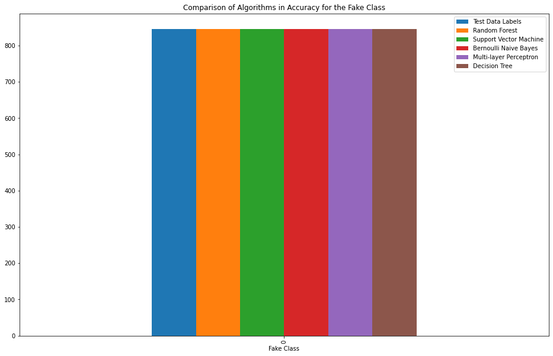
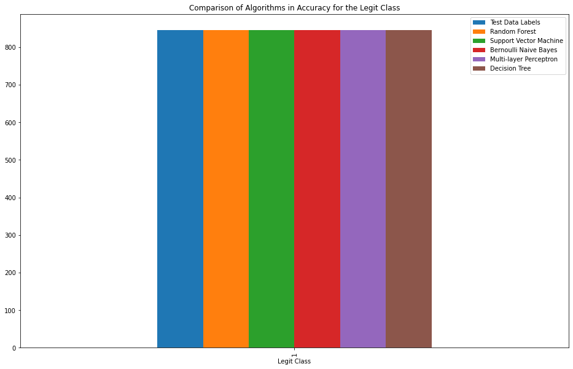
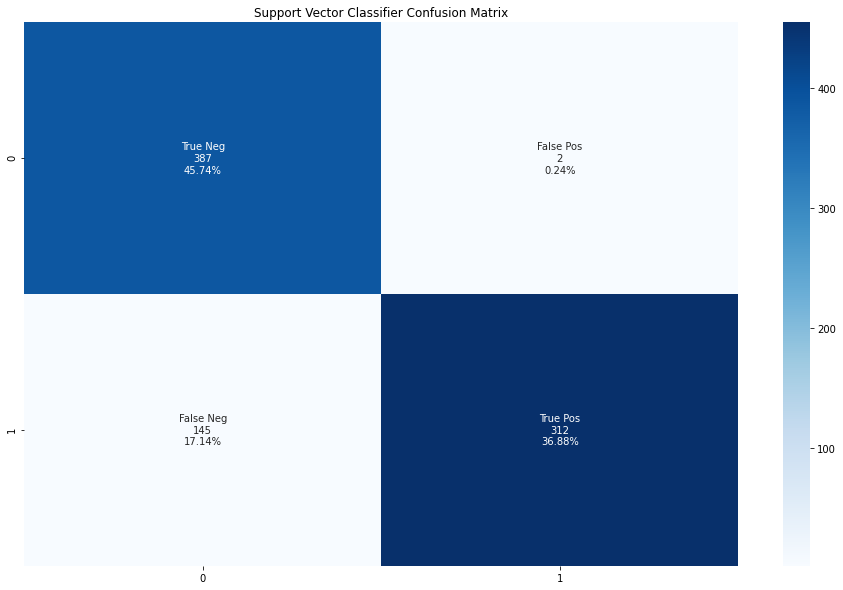
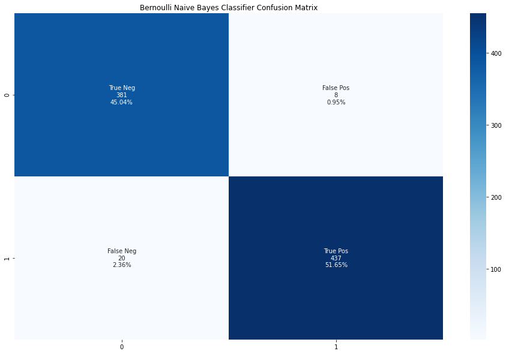
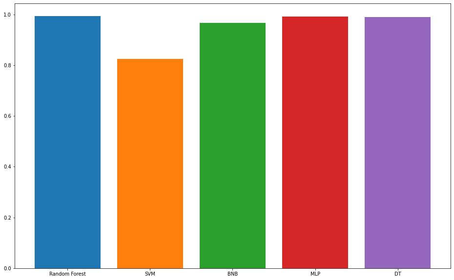
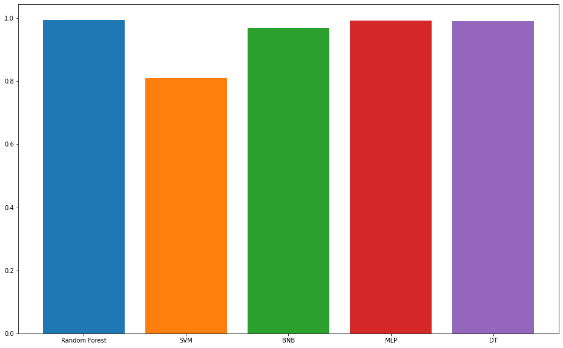

```python
import pandas as pd
import numpy as np
from matplotlib import pyplot as plt
import seaborn as sns

# Scikit-learn
from sklearn.model_selection import train_test_split
from sklearn.preprocessing import LabelEncoder
from sklearn.ensemble import RandomForestClassifier
from sklearn.svm import SVC
from sklearn.naive_bayes import BernoulliNB
from sklearn.neural_network import MLPClassifier
from sklearn.tree import DecisionTreeClassifier
from sklearn.metrics import confusion_matrix, accuracy_score, f1_score

plt.rcParams["figure.figsize"] = [16, 10]
```

# Loading Data


```python
fake = pd.read_csv('DATASET/fusers.csv')
legit = pd.read_csv('DATASET/users.csv')
```


```python
fake.head()
```


<div>
<style scoped>
    .dataframe tbody tr th:only-of-type {
        vertical-align: middle;
    }

    .dataframe tbody tr th {
        vertical-align: top;
    }

    .dataframe thead th {
        text-align: right;
    }
</style>
<table border="1" class="dataframe">
  <thead>
    <tr style="text-align: right;">
      <th></th>
      <th>id</th>
      <th>name</th>
      <th>screen_name</th>
      <th>statuses_count</th>
      <th>followers_count</th>
      <th>friends_count</th>
      <th>favourites_count</th>
      <th>listed_count</th>
      <th>created_at</th>
      <th>url</th>
      <th>...</th>
      <th>profile_background_image_url</th>
      <th>profile_background_color</th>
      <th>profile_link_color</th>
      <th>utc_offset</th>
      <th>protected</th>
      <th>verified</th>
      <th>description</th>
      <th>updated</th>
      <th>dataset</th>
      <th>label</th>
    </tr>
  </thead>
  <tbody>
    <tr>
      <th>0</th>
      <td>370098498</td>
      <td>pirfectmoses</td>
      <td>pirfectmoses</td>
      <td>24</td>
      <td>4</td>
      <td>588</td>
      <td>16</td>
      <td>0</td>
      <td>Thu Sep 08 13:20:35 +0000 2011</td>
      <td>NaN</td>
      <td>...</td>
      <td>http://a0.twimg.com/profile_background_images/...</td>
      <td>C6E2EE</td>
      <td>1F98C7</td>
      <td>NaN</td>
      <td>NaN</td>
      <td>NaN</td>
      <td>NaN</td>
      <td>2/14/2015 10:40</td>
      <td>INT</td>
      <td>fake</td>
    </tr>
    <tr>
      <th>1</th>
      <td>37384589</td>
      <td>SAK Nair</td>
      <td>bsknair1967</td>
      <td>656</td>
      <td>57</td>
      <td>693</td>
      <td>597</td>
      <td>0</td>
      <td>Sun May 03 07:35:13 +0000 2009</td>
      <td>NaN</td>
      <td>...</td>
      <td>http://a0.twimg.com/images/themes/theme1/bg.png</td>
      <td>C0DEED</td>
      <td>0084B4</td>
      <td>NaN</td>
      <td>NaN</td>
      <td>NaN</td>
      <td>in Kuwait with my buetiful family.</td>
      <td>2/14/2015 10:40</td>
      <td>INT</td>
      <td>fake</td>
    </tr>
    <tr>
      <th>2</th>
      <td>72110028</td>
      <td>Deepak</td>
      <td>dedjven</td>
      <td>1234</td>
      <td>15</td>
      <td>104</td>
      <td>1150</td>
      <td>0</td>
      <td>Sun Sep 06 19:50:08 +0000 2009</td>
      <td>NaN</td>
      <td>...</td>
      <td>http://a0.twimg.com/images/themes/theme14/bg.gif</td>
      <td>131516</td>
      <td>9999</td>
      <td>-39600.0</td>
      <td>NaN</td>
      <td>NaN</td>
      <td>NaN</td>
      <td>2/14/2015 10:40</td>
      <td>INT</td>
      <td>fake</td>
    </tr>
    <tr>
      <th>3</th>
      <td>82885728</td>
      <td>Marcos Vinicius</td>
      <td>BrowAlves</td>
      <td>573</td>
      <td>14</td>
      <td>227</td>
      <td>530</td>
      <td>0</td>
      <td>Fri Oct 16 14:02:48 +0000 2009</td>
      <td>NaN</td>
      <td>...</td>
      <td>http://a0.twimg.com/profile_background_images/...</td>
      <td>C0DEED</td>
      <td>0084B4</td>
      <td>NaN</td>
      <td>NaN</td>
      <td>NaN</td>
      <td>NaN</td>
      <td>2/14/2015 10:40</td>
      <td>INT</td>
      <td>fake</td>
    </tr>
    <tr>
      <th>4</th>
      <td>110120789</td>
      <td>Shri Kant Kanaujia</td>
      <td>kanaujiask</td>
      <td>675</td>
      <td>18</td>
      <td>519</td>
      <td>653</td>
      <td>0</td>
      <td>Sun Jan 31 12:08:41 +0000 2010</td>
      <td>NaN</td>
      <td>...</td>
      <td>http://a0.twimg.com/images/themes/theme1/bg.png</td>
      <td>C0DEED</td>
      <td>0084B4</td>
      <td>19800.0</td>
      <td>NaN</td>
      <td>NaN</td>
      <td>NaN</td>
      <td>2/14/2015 10:40</td>
      <td>INT</td>
      <td>fake</td>
    </tr>
  </tbody>
</table>
<p>5 rows × 35 columns</p>
</div>


```python
legit.head()
```


<div>
<style scoped>
    .dataframe tbody tr th:only-of-type {
        vertical-align: middle;
    }

    .dataframe tbody tr th {
        vertical-align: top;
    }

    .dataframe thead th {
        text-align: right;
    }
</style>
<table border="1" class="dataframe">
  <thead>
    <tr style="text-align: right;">
      <th></th>
      <th>id</th>
      <th>name</th>
      <th>screen_name</th>
      <th>statuses_count</th>
      <th>followers_count</th>
      <th>friends_count</th>
      <th>favourites_count</th>
      <th>listed_count</th>
      <th>created_at</th>
      <th>url</th>
      <th>...</th>
      <th>profile_background_image_url</th>
      <th>profile_background_color</th>
      <th>profile_link_color</th>
      <th>utc_offset</th>
      <th>protected</th>
      <th>verified</th>
      <th>description</th>
      <th>updated</th>
      <th>dataset</th>
      <th>label</th>
    </tr>
  </thead>
  <tbody>
    <tr>
      <th>0</th>
      <td>3610511</td>
      <td>Davide Dellacasa</td>
      <td>braddd</td>
      <td>20370</td>
      <td>5470</td>
      <td>2385</td>
      <td>145</td>
      <td>52</td>
      <td>Fri Apr 06 10:58:22 +0000 2007</td>
      <td>http://braddd.tumblr.com</td>
      <td>...</td>
      <td>http://a0.twimg.com/profile_background_images/...</td>
      <td>BADFCD</td>
      <td>FF0000</td>
      <td>3600.0</td>
      <td>NaN</td>
      <td>NaN</td>
      <td>Founder of http://www.screenweek.it &amp; http://w...</td>
      <td>2/14/2015 10:54</td>
      <td>E13</td>
      <td>legit</td>
    </tr>
    <tr>
      <th>1</th>
      <td>5656162</td>
      <td>Simone Economo</td>
      <td>eKoeS</td>
      <td>3131</td>
      <td>506</td>
      <td>381</td>
      <td>9</td>
      <td>40</td>
      <td>Mon Apr 30 15:08:42 +0000 2007</td>
      <td>http://www.lineheight.net/</td>
      <td>...</td>
      <td>http://a0.twimg.com/images/themes/theme1/bg.png</td>
      <td>C0DEED</td>
      <td>0084B4</td>
      <td>3600.0</td>
      <td>NaN</td>
      <td>NaN</td>
      <td>BSc degree (cum laude) in Computer Engineering...</td>
      <td>2/14/2015 10:54</td>
      <td>E13</td>
      <td>legit</td>
    </tr>
    <tr>
      <th>2</th>
      <td>5682702</td>
      <td>tacone</td>
      <td>tacone_</td>
      <td>4024</td>
      <td>264</td>
      <td>87</td>
      <td>323</td>
      <td>16</td>
      <td>Tue May 01 11:53:40 +0000 2007</td>
      <td>http://t.co/LKrl1dZE</td>
      <td>...</td>
      <td>http://a0.twimg.com/profile_background_images/...</td>
      <td>1A1B1F</td>
      <td>2FC2EF</td>
      <td>3600.0</td>
      <td>NaN</td>
      <td>NaN</td>
      <td>Cogito ergo bestemmio.</td>
      <td>2/14/2015 10:54</td>
      <td>E13</td>
      <td>legit</td>
    </tr>
    <tr>
      <th>3</th>
      <td>6067292</td>
      <td>alesaura</td>
      <td>alesstar</td>
      <td>40586</td>
      <td>640</td>
      <td>622</td>
      <td>1118</td>
      <td>32</td>
      <td>Tue May 15 16:55:16 +0000 2007</td>
      <td>http://alesstar.wordpress.com/</td>
      <td>...</td>
      <td>http://a0.twimg.com/images/themes/theme4/bg.gif</td>
      <td>0099B9</td>
      <td>0099B9</td>
      <td>3600.0</td>
      <td>NaN</td>
      <td>NaN</td>
      <td>Se la vita ti dà sarde, scapocciale!</td>
      <td>2/14/2015 10:54</td>
      <td>E13</td>
      <td>legit</td>
    </tr>
    <tr>
      <th>4</th>
      <td>6015122</td>
      <td>Angelo</td>
      <td>PerDiletto</td>
      <td>2016</td>
      <td>62</td>
      <td>64</td>
      <td>13</td>
      <td>0</td>
      <td>Sun May 13 19:52:00 +0000 2007</td>
      <td>http://www.flickr.com/per_diletto</td>
      <td>...</td>
      <td>http://a0.twimg.com/images/themes/theme18/bg.gif</td>
      <td>ACDED6</td>
      <td>38543</td>
      <td>3600.0</td>
      <td>NaN</td>
      <td>NaN</td>
      <td>Je me souviens</td>
      <td>2/14/2015 10:54</td>
      <td>E13</td>
      <td>legit</td>
    </tr>
  </tbody>
</table>
<p>5 rows × 35 columns</p>
</div>


# Removing unnecessary columns


```python
fake = fake.drop(columns=["id", "name", "screen_name", "created_at", "lang", "location", "default_profile", "default_profile_image", "geo_enabled", "profile_image_url", "profile_banner_url", "profile_use_background_image", "profile_background_image_url_https", "profile_text_color", "profile_image_url_https", "profile_sidebar_border_color", "profile_background_tile", "profile_sidebar_fill_color", "profile_background_image_url", "profile_background_color", "profile_link_color", "utc_offset", "protected", "verified", "dataset", "updated", "description", "url"], axis=1)
legit = legit.drop(columns=["id", "name", "screen_name", "created_at", "lang", "location", "default_profile", "default_profile_image", "geo_enabled", "profile_image_url", "profile_banner_url", "profile_use_background_image", "profile_background_image_url_https", "profile_text_color", "profile_image_url_https", "profile_sidebar_border_color", "profile_background_tile", "profile_sidebar_fill_color", "profile_background_image_url", "profile_background_color", "profile_link_color", "utc_offset", "protected", "verified", "dataset", "updated", "description", "url"], axis=1)
```


```python
fake.head()
```


<div>
<style scoped>
    .dataframe tbody tr th:only-of-type {
        vertical-align: middle;
    }

    .dataframe tbody tr th {
        vertical-align: top;
    }

    .dataframe thead th {
        text-align: right;
    }
</style>
<table border="1" class="dataframe">
  <thead>
    <tr style="text-align: right;">
      <th></th>
      <th>statuses_count</th>
      <th>followers_count</th>
      <th>friends_count</th>
      <th>favourites_count</th>
      <th>listed_count</th>
      <th>time_zone</th>
      <th>label</th>
    </tr>
  </thead>
  <tbody>
    <tr>
      <th>0</th>
      <td>24</td>
      <td>4</td>
      <td>588</td>
      <td>16</td>
      <td>0</td>
      <td>NaN</td>
      <td>fake</td>
    </tr>
    <tr>
      <th>1</th>
      <td>656</td>
      <td>57</td>
      <td>693</td>
      <td>597</td>
      <td>0</td>
      <td>NaN</td>
      <td>fake</td>
    </tr>
    <tr>
      <th>2</th>
      <td>1234</td>
      <td>15</td>
      <td>104</td>
      <td>1150</td>
      <td>0</td>
      <td>International Date Line West</td>
      <td>fake</td>
    </tr>
    <tr>
      <th>3</th>
      <td>573</td>
      <td>14</td>
      <td>227</td>
      <td>530</td>
      <td>0</td>
      <td>NaN</td>
      <td>fake</td>
    </tr>
    <tr>
      <th>4</th>
      <td>675</td>
      <td>18</td>
      <td>519</td>
      <td>653</td>
      <td>0</td>
      <td>New Delhi</td>
      <td>fake</td>
    </tr>
  </tbody>
</table>
</div>


```python
legit.head()
```


<div>
<style scoped>
    .dataframe tbody tr th:only-of-type {
        vertical-align: middle;
    }

    .dataframe tbody tr th {
        vertical-align: top;
    }

    .dataframe thead th {
        text-align: right;
    }
</style>
<table border="1" class="dataframe">
  <thead>
    <tr style="text-align: right;">
      <th></th>
      <th>statuses_count</th>
      <th>followers_count</th>
      <th>friends_count</th>
      <th>favourites_count</th>
      <th>listed_count</th>
      <th>time_zone</th>
      <th>label</th>
    </tr>
  </thead>
  <tbody>
    <tr>
      <th>0</th>
      <td>20370</td>
      <td>5470</td>
      <td>2385</td>
      <td>145</td>
      <td>52</td>
      <td>Rome</td>
      <td>legit</td>
    </tr>
    <tr>
      <th>1</th>
      <td>3131</td>
      <td>506</td>
      <td>381</td>
      <td>9</td>
      <td>40</td>
      <td>Rome</td>
      <td>legit</td>
    </tr>
    <tr>
      <th>2</th>
      <td>4024</td>
      <td>264</td>
      <td>87</td>
      <td>323</td>
      <td>16</td>
      <td>Rome</td>
      <td>legit</td>
    </tr>
    <tr>
      <th>3</th>
      <td>40586</td>
      <td>640</td>
      <td>622</td>
      <td>1118</td>
      <td>32</td>
      <td>Rome</td>
      <td>legit</td>
    </tr>
    <tr>
      <th>4</th>
      <td>2016</td>
      <td>62</td>
      <td>64</td>
      <td>13</td>
      <td>0</td>
      <td>Rome</td>
      <td>legit</td>
    </tr>
  </tbody>
</table>
</div>


# Changing all `NaN` to `0`


```python
fake = fake.fillna(0)
legit = legit.fillna(0)
```


```python
fake.info()
```

    <class 'pandas.core.frame.DataFrame'>
    RangeIndex: 1337 entries, 0 to 1336
    Data columns (total 7 columns):
     #   Column            Non-Null Count  Dtype 
    ---  ------            --------------  ----- 
     0   statuses_count    1337 non-null   int64 
     1   followers_count   1337 non-null   int64 
     2   friends_count     1337 non-null   int64 
     3   favourites_count  1337 non-null   int64 
     4   listed_count      1337 non-null   int64 
     5   time_zone         1337 non-null   object
     6   label             1337 non-null   object
    dtypes: int64(5), object(2)
    memory usage: 73.2+ KB
    


```python
legit.info()
```

    <class 'pandas.core.frame.DataFrame'>
    RangeIndex: 1481 entries, 0 to 1480
    Data columns (total 7 columns):
     #   Column            Non-Null Count  Dtype 
    ---  ------            --------------  ----- 
     0   statuses_count    1481 non-null   int64 
     1   followers_count   1481 non-null   int64 
     2   friends_count     1481 non-null   int64 
     3   favourites_count  1481 non-null   int64 
     4   listed_count      1481 non-null   int64 
     5   time_zone         1481 non-null   object
     6   label             1481 non-null   object
    dtypes: int64(5), object(2)
    memory usage: 81.1+ KB
    

# Creating merged dataset from legit and fake profile dataset.


```python
data = [fake, legit]
dataset = pd.concat(data)
dataset.head()
```


<div>
<style scoped>
    .dataframe tbody tr th:only-of-type {
        vertical-align: middle;
    }

    .dataframe tbody tr th {
        vertical-align: top;
    }

    .dataframe thead th {
        text-align: right;
    }
</style>
<table border="1" class="dataframe">
  <thead>
    <tr style="text-align: right;">
      <th></th>
      <th>statuses_count</th>
      <th>followers_count</th>
      <th>friends_count</th>
      <th>favourites_count</th>
      <th>listed_count</th>
      <th>time_zone</th>
      <th>label</th>
    </tr>
  </thead>
  <tbody>
    <tr>
      <th>0</th>
      <td>24</td>
      <td>4</td>
      <td>588</td>
      <td>16</td>
      <td>0</td>
      <td>0</td>
      <td>fake</td>
    </tr>
    <tr>
      <th>1</th>
      <td>656</td>
      <td>57</td>
      <td>693</td>
      <td>597</td>
      <td>0</td>
      <td>0</td>
      <td>fake</td>
    </tr>
    <tr>
      <th>2</th>
      <td>1234</td>
      <td>15</td>
      <td>104</td>
      <td>1150</td>
      <td>0</td>
      <td>International Date Line West</td>
      <td>fake</td>
    </tr>
    <tr>
      <th>3</th>
      <td>573</td>
      <td>14</td>
      <td>227</td>
      <td>530</td>
      <td>0</td>
      <td>0</td>
      <td>fake</td>
    </tr>
    <tr>
      <th>4</th>
      <td>675</td>
      <td>18</td>
      <td>519</td>
      <td>653</td>
      <td>0</td>
      <td>New Delhi</td>
      <td>fake</td>
    </tr>
  </tbody>
</table>
</div>


# Encoding Features with "Object" Datatype


```python
le = LabelEncoder()
```


```python
dataset['time_zone'] = le.fit_transform(dataset['time_zone'].astype(str))
dataset['label'] = le.fit_transform(dataset['label'].astype(str))
dataset.head()
```


<div>
<style scoped>
    .dataframe tbody tr th:only-of-type {
        vertical-align: middle;
    }

    .dataframe tbody tr th {
        vertical-align: top;
    }

    .dataframe thead th {
        text-align: right;
    }
</style>
<table border="1" class="dataframe">
  <thead>
    <tr style="text-align: right;">
      <th></th>
      <th>statuses_count</th>
      <th>followers_count</th>
      <th>friends_count</th>
      <th>favourites_count</th>
      <th>listed_count</th>
      <th>time_zone</th>
      <th>label</th>
    </tr>
  </thead>
  <tbody>
    <tr>
      <th>0</th>
      <td>24</td>
      <td>4</td>
      <td>588</td>
      <td>16</td>
      <td>0</td>
      <td>0</td>
      <td>0</td>
    </tr>
    <tr>
      <th>1</th>
      <td>656</td>
      <td>57</td>
      <td>693</td>
      <td>597</td>
      <td>0</td>
      <td>0</td>
      <td>0</td>
    </tr>
    <tr>
      <th>2</th>
      <td>1234</td>
      <td>15</td>
      <td>104</td>
      <td>1150</td>
      <td>0</td>
      <td>17</td>
      <td>0</td>
    </tr>
    <tr>
      <th>3</th>
      <td>573</td>
      <td>14</td>
      <td>227</td>
      <td>530</td>
      <td>0</td>
      <td>0</td>
      <td>0</td>
    </tr>
    <tr>
      <th>4</th>
      <td>675</td>
      <td>18</td>
      <td>519</td>
      <td>653</td>
      <td>0</td>
      <td>24</td>
      <td>0</td>
    </tr>
  </tbody>
</table>
</div>


# Shuffling Data Instances to Mix Up the Fake and Legit Instances


```python
dataset = dataset.sample(frac=1)
dataset.head()
```


<div>
<style scoped>
    .dataframe tbody tr th:only-of-type {
        vertical-align: middle;
    }

    .dataframe tbody tr th {
        vertical-align: top;
    }

    .dataframe thead th {
        text-align: right;
    }
</style>
<table border="1" class="dataframe">
  <thead>
    <tr style="text-align: right;">
      <th></th>
      <th>statuses_count</th>
      <th>followers_count</th>
      <th>friends_count</th>
      <th>favourites_count</th>
      <th>listed_count</th>
      <th>time_zone</th>
      <th>label</th>
    </tr>
  </thead>
  <tbody>
    <tr>
      <th>770</th>
      <td>38</td>
      <td>17</td>
      <td>288</td>
      <td>2</td>
      <td>0</td>
      <td>0</td>
      <td>0</td>
    </tr>
    <tr>
      <th>35</th>
      <td>59</td>
      <td>24</td>
      <td>619</td>
      <td>0</td>
      <td>0</td>
      <td>0</td>
      <td>0</td>
    </tr>
    <tr>
      <th>556</th>
      <td>48</td>
      <td>23</td>
      <td>389</td>
      <td>0</td>
      <td>0</td>
      <td>0</td>
      <td>0</td>
    </tr>
    <tr>
      <th>197</th>
      <td>34098</td>
      <td>13890</td>
      <td>12773</td>
      <td>85</td>
      <td>486</td>
      <td>4</td>
      <td>1</td>
    </tr>
    <tr>
      <th>343</th>
      <td>770</td>
      <td>42</td>
      <td>149</td>
      <td>28</td>
      <td>0</td>
      <td>2</td>
      <td>1</td>
    </tr>
  </tbody>
</table>
</div>


# Splitting Label and Features


```python
y = dataset['label']
X = dataset.drop(columns='label')
```

# Splitting Dataset into Train and Test


```python
X_train, X_test, y_train, y_test = train_test_split(X, y, test_size=0.3, random_state=42)
```

# Initializing Models


```python
rfc = RandomForestClassifier()
svm = SVC()
bnb = BernoulliNB()
mlp = MLPClassifier(max_iter=250)
dt = DecisionTreeClassifier()
```

# Training the Models


```python
rfc.fit(X_train, y_train)
svm.fit(X_train, y_train)
bnb.fit(X_train, y_train)
mlp.fit(X_train, y_train)
dt.fit(X_train, y_train)
```


    DecisionTreeClassifier()


# Predicting with the Models


```python
rfc_pred = rfc.predict(X_test)
svm_pred = svm.predict(X_test)
bnb_pred = bnb.predict(X_test)
mlp_pred = mlp.predict(X_test)
dt_pred = dt.predict(X_test)
```

# Performance Metrics


```python
fgraph = pd.DataFrame([[0, len(y_test == 0), len(rfc_pred == 0), len(svm_pred == 0), len(bnb_pred == 0), len(mlp_pred == 0), len(dt_pred == 0)]],
                    columns=['Fake Class', 'Test Data Labels', 'Random Forest', 'Support Vector Machine', 'Bernoulli Naive Bayes', 'Multi-layer Perceptron', 'Decision Tree'])
```


```python
fgraph.plot(x='Fake Class', kind='bar', stacked=False, title='Comparison of Algorithms in Accuracy for the Fake Class')
```


    <AxesSubplot:title={'center':'Comparison of Algorithms in Accuracy for the Fake Class'}, xlabel='Fake Class'>


    

    


```python
lgraph = pd.DataFrame([[1, len(y_test == 1), len(rfc_pred == 1), len(svm_pred == 1), len(bnb_pred == 1), len(mlp_pred == 1), len(dt_pred == 1)]],
                    columns=['Legit Class', 'Test Data Labels', 'Random Forest', 'Support Vector Machine', 'Bernoulli Naive Bayes', 'Multi-layer Perceptron', 'Decision Tree'])
```


```python
lgraph.plot(x='Legit Class', kind='bar', stacked=False, title='Comparison of Algorithms in Accuracy for the Legit Class')
```


    <AxesSubplot:title={'center':'Comparison of Algorithms in Accuracy for the Legit Class'}, xlabel='Legit Class'>


    

    


```python
rfc_cm = confusion_matrix(y_test, rfc_pred)
svm_cm = confusion_matrix(y_test, svm_pred)
bnb_cm = confusion_matrix(y_test, bnb_pred)
mlp_cm = confusion_matrix(y_test, mlp_pred)
dt_cm = confusion_matrix(y_test, dt_pred)
```


```python
group_names = ['True Neg', 'False Pos', 'False Neg', 'True Pos']
group_counts = ["{0:0.0f}".format(value) for value in rfc_cm.flatten()]
group_percentages = ["{0:.2%}".format(value) for value in rfc_cm.flatten()/np.sum(rfc_cm)]
labels = [f"{v1}\n{v2}\n{v3}" for v1, v2, v3 in zip(group_names, group_counts, group_percentages)]
labels = np.asarray(labels).reshape(2, 2)
plt.title('Random Forest Classifier Confusion Matrix')
sns.heatmap(rfc_cm, annot=labels, fmt='', cmap='Blues')
```


    <AxesSubplot:title={'center':'Random Forest Classifier Confusion Matrix'}>


    

    


```python
group_names = ['True Neg', 'False Pos', 'False Neg', 'True Pos']
group_counts = ["{0:0.0f}".format(value) for value in svm_cm.flatten()]
group_percentages = ["{0:.2%}".format(value) for value in svm_cm.flatten()/np.sum(svm_cm)]
labels = [f"{v1}\n{v2}\n{v3}" for v1, v2, v3 in zip(group_names, group_counts, group_percentages)]
labels = np.asarray(labels).reshape(2, 2)
plt.title('Support Vector Classifier Confusion Matrix')
sns.heatmap(rfc_cm, annot=labels, fmt='', cmap='Blues')
```


    <AxesSubplot:title={'center':'Support Vector Classifier Confusion Matrix'}>


    

    


```python
group_names = ['True Neg', 'False Pos', 'False Neg', 'True Pos']
group_counts = ["{0:0.0f}".format(value) for value in bnb_cm.flatten()]
group_percentages = ["{0:.2%}".format(value) for value in bnb_cm.flatten()/np.sum(bnb_cm)]
labels = [f"{v1}\n{v2}\n{v3}" for v1, v2, v3 in zip(group_names, group_counts, group_percentages)]
labels = np.asarray(labels).reshape(2, 2)
plt.title('Bernoulli Naive Bayes Classifier Confusion Matrix')
sns.heatmap(rfc_cm, annot=labels, fmt='', cmap='Blues')
```


    <AxesSubplot:title={'center':'Bernoulli Naive Bayes Classifier Confusion Matrix'}>


    

    


```python
group_names = ['True Neg', 'False Pos', 'False Neg', 'True Pos']
group_counts = ["{0:0.0f}".format(value) for value in mlp_cm.flatten()]
group_percentages = ["{0:.2%}".format(value) for value in mlp_cm.flatten()/np.sum(mlp_cm)]
labels = [f"{v1}\n{v2}\n{v3}" for v1, v2, v3 in zip(group_names, group_counts, group_percentages)]
labels = np.asarray(labels).reshape(2, 2)
plt.title('Multi-layer Perceptron Confusion Matrix')
sns.heatmap(rfc_cm, annot=labels, fmt='', cmap='Blues')
```


    <AxesSubplot:title={'center':'Multi-layer Perceptron Confusion Matrix'}>


    

    


```python
group_names = ['True Neg', 'False Pos', 'False Neg', 'True Pos']
group_counts = ["{0:0.0f}".format(value) for value in dt_cm.flatten()]
group_percentages = ["{0:.2%}".format(value) for value in dt_cm.flatten()/np.sum(dt_cm)]
labels = [f"{v1}\n{v2}\n{v3}" for v1, v2, v3 in zip(group_names, group_counts, group_percentages)]
labels = np.asarray(labels).reshape(2, 2)
plt.title('Decision Tree Classifier Confusion Matrix')
sns.heatmap(rfc_cm, annot=labels, fmt='', cmap='Blues')
```


    <AxesSubplot:title={'center':'Decision Tree Classifier Confusion Matrix'}>


    

    


```python
print("Random Forest Classifier Accuracy: ", accuracy_score(y_test, rfc_pred))
print("Support Vector Classifier Accuracy: ", accuracy_score(y_test, svm_pred))
print("Bernoulli Naive Bayes Classifier Accuracy: ", accuracy_score(y_test, bnb_pred))
print("Multi-layer Perceptron Accuracy: ", accuracy_score(y_test, mlp_pred))
print("Decision Tree Classifier Accuracy: ", accuracy_score(y_test, dt_pred))
```

    Random Forest Classifier Accuracy:  0.9940898345153665
    Support Vector Classifier Accuracy:  0.8262411347517731
    Bernoulli Naive Bayes Classifier Accuracy:  0.966903073286052
    Multi-layer Perceptron Accuracy:  0.9929078014184397
    Decision Tree Classifier Accuracy:  0.9905437352245863
    


```python
plt.bar('Random Forest', accuracy_score(y_test, rfc_pred))
plt.bar('SVM', accuracy_score(y_test, svm_pred))
plt.bar('BNB', accuracy_score(y_test, bnb_pred))
plt.bar('MLP', accuracy_score(y_test, mlp_pred))
plt.bar('DT', accuracy_score(y_test, dt_pred))
```


    <BarContainer object of 1 artists>


    

    


```python
print("Random Forest Classifier F1-score: ", f1_score(y_test, rfc_pred))
print("Support Vector Classifier F1-score: ", f1_score(y_test, svm_pred))
print("Bernoulli Naive Bayes Classifier F1-score: ", f1_score(y_test, bnb_pred))
print("Multi-layer Perceptron F1-score: ", f1_score(y_test, mlp_pred))
print("Decision Tree Classifier F1-score: ", f1_score(y_test, dt_pred))
```

    Random Forest Classifier F1-score:  0.994535519125683
    Support Vector Classifier F1-score:  0.8093385214007782
    Bernoulli Naive Bayes Classifier F1-score:  0.9689578713968958
    Multi-layer Perceptron F1-score:  0.9934354485776805
    Decision Tree Classifier F1-score:  0.9912280701754386
    


```python
plt.bar('Random Forest', f1_score(y_test, rfc_pred))
plt.bar('SVM', f1_score(y_test, svm_pred))
plt.bar('BNB', f1_score(y_test, bnb_pred))
plt.bar('MLP', f1_score(y_test, mlp_pred))
plt.bar('DT', f1_score(y_test, dt_pred))
```


    <BarContainer object of 1 artists>


    

    

